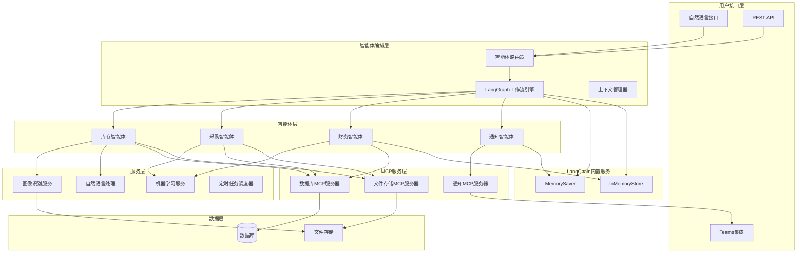
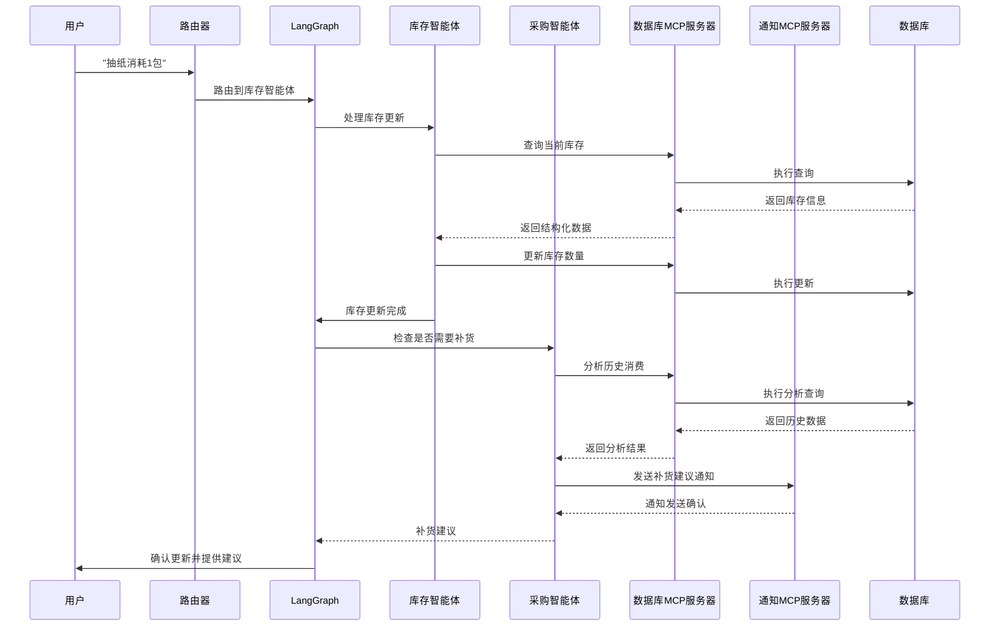

# 设计文档

## 概述

购物助手智能体系统采用基于LangChain和LangGraph的多智能体架构，通过专业化智能体协作处理家庭购物管理的各个方面。系统设计为事件驱动的微服务架构，每个智能体负责特定领域的功能，通过LangGraph工作流进行编排和协调。

核心设计原则：
- **智能体专业化**: 每个智能体专注于特定领域（库存、采购、财务）
- **松耦合架构**: 智能体通过消息传递和事件进行通信
- **可扩展性**: 支持新智能体的动态添加和功能扩展
- **容错性**: 具备错误恢复和重试机制
- **多模态交互**: 支持文本、图像和语音输入

## 架构

### 系统架构图



### 智能体交互流程



## 组件和接口

### 核心智能体组件

#### 1. 库存智能体 (InventoryAgent)

**职责:**
- 自然语言库存命令解析
- 图像识别和OCR处理协调
- 库存数据管理逻辑
- 库存阈值监控和预警

**接口:**
```typescript
interface InventoryAgent {
  processNaturalLanguageCommand(command: string): Promise<InventoryUpdateResult>
  processPhotoUpload(photoFileId: string, description: string): Promise<ItemAddResult>
  updateInventory(itemId: string, quantity: number): Promise<boolean>
  checkInventoryLevels(): Promise<LowStockAlert[]>
  getInventoryStatus(itemName?: string): Promise<InventoryItem[]>

  // MCP集成方法
  private callDatabaseMCP(toolName: string, params: any): Promise<any>
  private callFileStorageMCP(toolName: string, params: any): Promise<any>
}
```

#### 2. 采购智能体 (ProcurementAgent)

**职责:**
- 订单导入和解析逻辑
- 采购建议算法
- 购物清单管理逻辑
- 多平台数据标准化

**接口:**
```typescript
interface ProcurementAgent {
  importOrders(fileId: string, platform: string): Promise<ImportResult>
  generatePurchaseRecommendations(): Promise<PurchaseRecommendation[]>
  manageTodoList(action: TodoAction, item: TodoItem): Promise<boolean>
  analyzePurchasePatterns(): Promise<PurchaseAnalysis>
  optimizePurchaseTiming(items: string[]): Promise<TimingRecommendation[]>

  // MCP集成方法
  private callDatabaseMCP(toolName: string, params: any): Promise<any>
  private callFileStorageMCP(toolName: string, params: any): Promise<any>
}
```

#### 3. 财务智能体 (FinanceAgent)

**职责:**
- 支出分析算法和分类逻辑
- 财务报告生成逻辑
- 异常消费检测算法
- 预算管理和监控

**接口:**
```typescript
interface FinanceAgent {
  generateMonthlyReport(month: string): Promise<FinancialReport>
  detectAnomalousSpending(): Promise<SpendingAlert[]>
  categorizeExpenses(orderIds: string[]): Promise<CategorizedExpenses>
  trackBudgetStatus(): Promise<BudgetStatus>
  generateQuarterlyAnalysis(): Promise<QuarterlyReport>

  // MCP集成方法
  private callDatabaseMCP(toolName: string, params: any): Promise<any>

  // LangChain内置缓存
  private cacheAnalysisResult(key: string, result: any): Promise<void>
  private getCachedResult(key: string): Promise<any | null>
}
```

#### 4. 通知智能体 (NotificationAgent)

**职责:**
- 通知内容智能生成和优化
- 通知时机和频率控制
- 用户偏好学习和适应
- 通知效果分析和改进

**接口:**
```typescript
interface NotificationAgent {
  sendSmartNotification(content: NotificationContent, context: NotificationContext): Promise<boolean>
  scheduleIntelligentNotification(notification: IntelligentNotification): Promise<string>
  sendContextualAlert(alert: ContextualAlert): Promise<boolean>
  optimizeNotificationTiming(userId: string, notificationType: string): Promise<OptimalTiming>
  analyzeNotificationEffectiveness(): Promise<NotificationAnalytics>

  // MCP集成方法
  private callNotificationMCP(toolName: string, params: any): Promise<any>

  // LangChain内置状态管理
  private saveConversationState(conversationId: string, state: any): Promise<void>
  private loadConversationState(conversationId: string): Promise<any>
}

// 智能通知相关模型
interface NotificationContent {
  type: 'inventory_alert' | 'purchase_recommendation' | 'financial_report' | 'system_update'
  priority: 'low' | 'normal' | 'high' | 'urgent'
  data: any
  userId: string
}

interface NotificationContext {
  userActivity: UserActivity
  currentTime: Date
  recentNotifications: RecentNotification[]
  userPreferences: NotificationPreferences
}

interface IntelligentNotification {
  content: NotificationContent
  optimalTiming: OptimalTiming
  personalization: PersonalizationSettings
  fallbackChannels: string[]
}

interface OptimalTiming {
  recommendedTime: Date
  confidence: number
  reasoning: string
  alternativeTimes: Date[]
}

interface NotificationAnalytics {
  deliveryRate: number
  readRate: number
  actionRate: number
  channelEffectiveness: Record<string, number>
  timeEffectiveness: Record<string, number>
  recommendations: string[]
}
```

### MCP服务器组件

#### 数据库MCP服务器

**职责:**
- 提供统一的数据库访问接口
- 处理SQL查询和事务管理
- 实现数据访问权限控制
- 提供查询优化和缓存

**MCP工具接口:**
```typescript
interface DatabaseMCPTools {
  // 库存相关操作
  getInventoryItem(itemName: string): Promise<InventoryItem | null>
  updateInventoryQuantity(itemId: string, quantity: number): Promise<boolean>
  addInventoryItem(item: CreateInventoryItem): Promise<string>
  searchInventoryItems(criteria: SearchCriteria): Promise<InventoryItem[]>

  // 订单相关操作
  createOrder(order: CreateOrder): Promise<string>
  getOrderHistory(filters: OrderFilters): Promise<Order[]>
  updateOrderStatus(orderId: string, status: string): Promise<boolean>

  // 购物清单操作
  getShoppingList(): Promise<ShoppingListItem[]>
  addToShoppingList(item: CreateShoppingListItem): Promise<string>
  updateShoppingListItem(id: string, updates: Partial<ShoppingListItem>): Promise<boolean>
  removeFromShoppingList(id: string): Promise<boolean>

  // 财务分析操作
  getSpendingByCategory(dateRange: DateRange): Promise<CategorySpending[]>
  getMonthlyReport(month: string): Promise<MonthlyReport>
  detectAnomalousSpending(threshold: number): Promise<SpendingAnomaly[]>

  // 通用查询操作
  executeQuery(sql: string, params: any[]): Promise<QueryResult>
  executeTransaction(operations: DatabaseOperation[]): Promise<TransactionResult>
}
```

#### 文件存储MCP服务器

**职责:**
- 管理图片和文档存储
- 提供OCR和图像处理服务
- 处理Excel文件解析
- 实现文件版本控制

**MCP工具接口:**
```typescript
interface FileStorageMCPTools {
  uploadFile(file: Buffer, metadata: FileMetadata): Promise<string>
  downloadFile(fileId: string): Promise<Buffer>
  processImage(fileId: string, options: ImageProcessingOptions): Promise<OCRResult>
  parseExcelFile(fileId: string, sheetName?: string): Promise<ExcelData>
  deleteFile(fileId: string): Promise<boolean>
  getFileMetadata(fileId: string): Promise<FileMetadata>
}
```

#### 缓存和状态管理

**设计决策：使用 LangChain 内置缓存功能**

基于架构简化和避免重复造轮子的原则，我们将使用 LangChain 的内置缓存和状态管理功能，而不是实现独立的 CacheMCPServer：

**LangChain 内置功能使用：**
```typescript
// 对话状态管理 - 使用 LangGraph 的内置状态管理
import { MemorySaver } from "@langchain/langgraph";
import { InMemoryStore } from "@langchain/core/stores";

// 对话记忆管理
const memorySaver = new MemorySaver();

// 通用缓存存储
const cacheStore = new InMemoryStore();

// 智能体状态持久化
interface AgentStateManager {
  saveConversationState(conversationId: string, state: any): Promise<void>;
  loadConversationState(conversationId: string): Promise<any>;
  cacheAnalysisResult(key: string, result: any, ttl?: number): Promise<void>;
  getCachedResult(key: string): Promise<any | null>;
}
```

#### 通知MCP服务器

**职责:**
- 统一的通知发送接口
- 支持多种通知渠道（Teams、钉钉、企业微信、Slack等）
- 通知模板管理和个性化
- 通知发送状态跟踪和重试

**MCP工具接口:**
```typescript
interface NotificationMCPTools {
  // 基础通知发送
  sendNotification(notification: NotificationRequest): Promise<NotificationResult>
  sendBulkNotifications(notifications: NotificationRequest[]): Promise<NotificationResult[]>

  // 渠道管理
  configureChannel(channelConfig: NotificationChannelConfig): Promise<boolean>
  getAvailableChannels(): Promise<NotificationChannel[])
  testChannelConnection(channelName: string): Promise<ChannelTestResult>

  // 模板管理
  createTemplate(template: NotificationTemplate): Promise<string>
  updateTemplate(templateId: string, template: Partial<NotificationTemplate>): Promise<boolean>
  getTemplate(templateId: string): Promise<NotificationTemplate | null>
  renderTemplate(templateId: string, data: any): Promise<RenderedNotification>

  // 订阅和偏好管理
  subscribeUser(userId: string, preferences: NotificationPreferences): Promise<boolean>
  updateUserPreferences(userId: string, preferences: Partial<NotificationPreferences>): Promise<boolean>
  getUserPreferences(userId: string): Promise<NotificationPreferences | null>

  // 通知历史和状态
  getNotificationStatus(notificationId: string): Promise<NotificationStatus>
  getNotificationHistory(filters: NotificationHistoryFilters): Promise<NotificationHistoryItem[]>
  retryFailedNotification(notificationId: string): Promise<NotificationResult>
}

// 通知相关数据模型
interface NotificationRequest {
  recipientId: string
  channels: string[] // ['teams', 'dingtalk', 'wechat-work']
  priority: 'low' | 'normal' | 'high' | 'urgent'
  templateId?: string
  customMessage?: CustomMessage
  data?: Record<string, any>
  scheduledTime?: Date
  expiryTime?: Date
}

interface CustomMessage {
  title: string
  content: string
  attachments?: NotificationAttachment[]
  actions?: NotificationAction[]
}

interface NotificationAttachment {
  type: 'image' | 'file' | 'link'
  url: string
  title?: string
  description?: string
}

interface NotificationAction {
  actionId: string
  label: string
  actionType: 'button' | 'link' | 'quick-reply'
  actionData: any
}

interface NotificationChannelConfig {
  channelName: string
  channelType: 'teams' | 'dingtalk' | 'wechat-work' | 'slack' | 'email' | 'sms'
  config: {
    webhookUrl?: string
    apiKey?: string
    appId?: string
    appSecret?: string
    [key: string]: any
  }
  enabled: boolean
  rateLimits?: RateLimitConfig
}

interface RateLimitConfig {
  maxRequestsPerMinute: number
  maxRequestsPerHour: number
  maxRequestsPerDay: number
}

interface NotificationPreferences {
  userId: string
  enabledChannels: string[]
  quietHours?: {
    start: string // "22:00"
    end: string   // "08:00"
    timezone: string
  }
  categoryPreferences: Record<string, boolean> // { 'inventory_alert': true, 'financial_report': false }
  language: 'zh-CN' | 'en-US'
}

interface NotificationResult {
  notificationId: string
  success: boolean
  channelResults: ChannelResult[]
  error?: string
}

interface ChannelResult {
  channelName: string
  success: boolean
  messageId?: string
  error?: string
  deliveredAt?: Date
}
```

### LangGraph工作流引擎

**核心功能:**
- 智能体编排和协调
- 状态管理和持久化
- 错误处理和重试
- 并行任务执行
- MCP服务器集成管理

**接口:**
```typescript
interface LangGraphWorkflow {
  executeWorkflow(workflowId: string, input: any): Promise<WorkflowResult>
  createWorkflow(definition: WorkflowDefinition): Promise<string>
  getWorkflowStatus(workflowId: string): Promise<WorkflowStatus>
  pauseWorkflow(workflowId: string): Promise<boolean>
  resumeWorkflow(workflowId: string): Promise<boolean>

  // MCP集成方法
  registerMCPServer(serverConfig: MCPServerConfig): Promise<boolean>
  callMCPTool(serverName: string, toolName: string, params: any): Promise<any>
  getMCPServerStatus(serverName: string): Promise<MCPServerStatus>
}
```

## 数据模型

### 智能体状态模型

```typescript
interface AgentState {
  agentId: string
  status: 'idle' | 'processing' | 'waiting' | 'error'
  currentTask?: Task
  context: Record<string, any>
  lastActivity: Date
  errorCount: number
}
```

### 工作流状态模型

```typescript
interface WorkflowState {
  workflowId: string
  currentStep: string
  stepHistory: WorkflowStep[]
  globalContext: Record<string, any>
  agentStates: Map<string, AgentState>
  status: 'running' | 'completed' | 'failed' | 'paused'
}
```

### 消息模型

```typescript
interface AgentMessage {
  messageId: string
  fromAgent: string
  toAgent: string
  messageType: 'request' | 'response' | 'notification' | 'error'
  payload: any
  timestamp: Date
  correlationId?: string
}
```

### 扩展的数据模型

基于现有数据库设计，添加智能体系统和MCP集成所需的模型：

```typescript
interface AgentTask {
  taskId: string
  agentId: string
  taskType: string
  priority: number
  status: 'pending' | 'processing' | 'completed' | 'failed'
  input: any
  output?: any
  createdAt: Date
  completedAt?: Date
  retryCount: number
}

interface ConversationContext {
  conversationId: string
  userId: string
  currentIntent: string
  entities: Record<string, any>
  history: ConversationTurn[]
  lastActivity: Date
}

interface ConversationTurn {
  turnId: string
  userInput: string
  agentResponse: string
  intent: string
  entities: Record<string, any>
  timestamp: Date
}

// MCP相关模型
interface MCPServerConfig {
  serverName: string
  serverType: 'database' | 'file-storage' | 'notification' | 'custom'
  connectionString: string
  authConfig?: MCPAuthConfig
  capabilities: string[]
  healthCheckEndpoint?: string
  retryPolicy: RetryPolicy
}

interface MCPAuthConfig {
  authType: 'none' | 'api-key' | 'oauth' | 'certificate'
  credentials: Record<string, string>
}

interface MCPServerStatus {
  serverName: string
  status: 'connected' | 'disconnected' | 'error' | 'initializing'
  lastHealthCheck: Date
  errorMessage?: string
  capabilities: string[]
  responseTime: number
}

interface MCPToolCall {
  callId: string
  serverName: string
  toolName: string
  parameters: any
  timestamp: Date
  duration?: number
  success: boolean
  result?: any
  error?: string
}

// 文件处理相关模型
interface FileMetadata {
  fileId: string
  originalName: string
  mimeType: string
  size: number
  uploadedBy: string
  uploadedAt: Date
  tags: string[]
  processingStatus: 'pending' | 'processing' | 'completed' | 'failed'
}

interface OCRResult {
  fileId: string
  extractedText: string
  confidence: number
  detectedFields: DetectedField[]
  processingTime: number
}

interface DetectedField {
  fieldType: 'expiry_date' | 'production_date' | 'warranty_info' | 'product_name' | 'price' | 'other'
  value: string
  confidence: number
  boundingBox?: BoundingBox
}

interface BoundingBox {
  x: number
  y: number
  width: number
  height: number
}
```

## 正确性属性

*属性是应该在系统的所有有效执行中保持为真的特征或行为——本质上是关于系统应该做什么的正式陈述。属性作为人类可读规范和机器可验证正确性保证之间的桥梁。*

### 属性反思

在分析所有可测试的验收标准后，我识别出以下可以合并或简化的冗余属性：

**冗余分析:**
- 属性1.1和1.2都涉及自然语言命令处理，可以合并为一个综合的命令处理属性
- 属性3.4和8.1都涉及Teams通知发送，可以合并为通用通知属性
- 属性2.4和1.3都涉及库存数据库更新，可以合并为库存持久化属性
- 多个错误处理属性(1.4, 2.5, 4.5, 8.5)可以合并为通用错误处理属性

**合并后的核心属性:**

**属性 1: 自然语言命令处理一致性**
*对于任何*有效的自然语言库存命令，系统应正确解析意图、提取物品详情，并按指定数量更新库存
**验证需求: 需求 1.1, 1.2**

**属性 2: 库存数据持久化**
*对于任何*库存更新操作（增加或减少），数据库中的库存数量应立即反映变化
**验证需求: 需求 1.3, 2.4**

**属性 3: 阈值触发通知**
*对于任何*库存物品，当数量达到预定义阈值时，系统应自动触发相应的通知或建议
**验证需求: 需求 1.5, 8.2**

**属性 4: 图像信息提取完整性**
*对于任何*包含产品信息的图像，OCR系统应提取所有可识别的文本信息，并与用户输入正确整合
**验证需求: 需求 2.1, 2.2, 2.3**

**属性 5: 采购建议生成逻辑**
*对于任何*历史采购数据集，采购智能体应基于消费模式、季节性和库存水平生成合理的补货建议
**验证需求: 需求 3.1, 3.2, 3.3**

**属性 6: 多平台数据标准化**
*对于任何*来自支持平台的订单数据，系统应将其转换为统一的内部格式，并正确更新相关记录
**验证需求: 需求 4.1, 4.2, 4.3**

**属性 7: 重复数据检测**
*对于任何*导入的订单数据，系统应检测并防止重复条目的创建
**验证需求: 需求 4.4**

**属性 8: 财务分析准确性**
*对于任何*给定时间段的支出数据，财务智能体应生成准确的分类报告和异常检测结果
**验证需求: 需求 5.1, 5.2, 5.4, 5.5**

**属性 9: 工作流状态一致性**
*对于任何*多智能体协作工作流，系统应在智能体交接过程中保持上下文和状态的一致性
**验证需求: 需求 6.1, 6.2, 6.5**

**属性 10: 对话上下文连续性**
*对于任何*多轮对话，自然语言接口应维护上下文信息，并将请求正确路由到适当的智能体
**验证需求: 需求 7.1, 7.2, 7.4**

**属性 11: 多语言处理一致性**
*对于任何*中文或英文输入，自然语言接口应提供一致的处理质量和响应准确性
**验证需求: 需求 7.5**

**属性 12: 通知发送可靠性**
*对于任何*需要发送通知的事件（分析完成、异常检测、季节建议），系统应通过Teams集成可靠地发送通知
**验证需求: 需求 3.4, 5.3, 8.1, 8.3, 8.4**

**属性 13: 错误处理和恢复**
*对于任何*系统错误或异常情况，相关智能体应提供适当的错误消息、实施恢复机制，并记录事件
**验证需求: 需求 1.4, 2.5, 4.5, 6.3, 8.5**

**属性 14: 安全访问控制**
*对于任何*智能体对外部资源的访问请求，系统应验证权限并提供安全的访问机制
**验证需求: 需求 6.4**

**属性 15: 澄清机制有效性**
*对于任何*模糊或不完整的用户输入，自然语言接口应询问具体问题以获得必要的澄清
**验证需求: 需求 7.3**

## 错误处理

### 智能体级别错误处理

**错误分类:**
1. **输入验证错误**: 无效的用户输入或数据格式
2. **处理逻辑错误**: 智能体内部处理失败
3. **MCP服务错误**: MCP服务器连接或工具调用失败
4. **外部服务错误**: 第三方API或服务不可用
5. **工作流协调错误**: 智能体间通信或状态同步失败

**错误处理策略:**

```typescript
interface ErrorHandlingStrategy {
  errorType: ErrorType
  retryPolicy: RetryPolicy
  fallbackAction: FallbackAction
  notificationLevel: NotificationLevel
}

enum ErrorType {
  INPUT_VALIDATION = 'input_validation',
  PROCESSING_LOGIC = 'processing_logic',
  MCP_SERVICE = 'mcp_service',
  EXTERNAL_SERVICE = 'external_service',
  WORKFLOW_COORDINATION = 'workflow_coordination'
}

interface RetryPolicy {
  maxRetries: number
  backoffStrategy: 'exponential' | 'linear' | 'fixed'
  baseDelay: number
  maxDelay: number
}
```

**具体错误处理机制:**

1. **库存智能体错误处理**
   - OCR失败: 请求用户手动输入
   - MCP数据库服务不可用: 使用LangChain InMemoryStore临时存储
   - 无效命令: 提供建议和示例

2. **采购智能体错误处理**
   - 文件解析失败: 提供格式要求和示例
   - MCP文件存储服务异常: 降级到本地临时存储
   - 数据重复: 智能去重和用户确认

3. **财务智能体错误处理**
   - 计算异常: 回退到简化算法
   - MCP数据库查询超时: 使用缓存数据生成部分报告
   - 异常检测误报: 用户反馈学习机制

4. **通知智能体错误处理**
   - 通知发送失败: 切换到备用通知渠道
   - MCP通知服务异常: 降级到简单邮件通知
   - 用户偏好获取失败: 使用默认通知设置

5. **MCP服务错误处理**
   - 连接超时: 自动重试和断路器模式
   - 工具调用失败: 降级到备用实现
   - 服务不可用: 切换到备用MCP服务器
   - 通知渠道故障: 自动切换到可用渠道

### 系统级别错误恢复

**断路器模式:**
```typescript
interface CircuitBreaker {
  serviceName: string
  failureThreshold: number
  recoveryTimeout: number
  state: 'closed' | 'open' | 'half-open'

  call<T>(operation: () => Promise<T>): Promise<T>
  onFailure(error: Error): void
  onSuccess(): void
}
```

**状态恢复机制:**
- 工作流检查点: 定期保存工作流状态
- 智能体状态快照: 关键操作前保存状态
- 事务性操作: 确保数据一致性
- 补偿操作: 失败时的回滚机制

## 测试策略

### 双重测试方法

系统将采用单元测试和基于属性的测试相结合的方法：

**单元测试覆盖:**
- 智能体核心功能的具体示例
- 边界条件和错误情况
- 集成点验证
- API接口契约测试

**基于属性的测试覆盖:**
- 使用fast-check库进行TypeScript属性测试
- 每个属性测试运行最少100次迭代
- 智能生成器约束到合理的输入空间
- 验证系统在各种输入下的通用正确性属性

**测试框架配置:**
- **单元测试**: Jest + TypeScript
- **属性测试**: fast-check
- **MCP集成测试**: 模拟MCP服务器 + 契约测试
- **集成测试**: Supertest + 测试数据库
- **端到端测试**: Playwright

**测试数据生成策略:**
```typescript
// 智能体消息生成器
const agentMessageGenerator = fc.record({
  messageId: fc.uuid(),
  fromAgent: fc.constantFrom('inventory', 'procurement', 'finance', 'notification'),
  toAgent: fc.constantFrom('inventory', 'procurement', 'finance', 'notification'),
  messageType: fc.constantFrom('request', 'response', 'notification', 'error'),
  payload: fc.anything(),
  timestamp: fc.date()
})

// 库存命令生成器
const inventoryCommandGenerator = fc.record({
  action: fc.constantFrom('消耗', '添加', '查询', '更新'),
  itemName: fc.stringOf(fc.char(), { minLength: 1, maxLength: 50 }),
  quantity: fc.integer({ min: 1, max: 100 }),
  unit: fc.constantFrom('包', '个', '瓶', '盒', '袋')
})
```

**属性测试标记格式:**
每个基于属性的测试必须使用以下格式标记：
`**Feature: shopping-assistant-agents, Property {number}: {property_text}**`

**测试执行要求:**
- 所有属性测试配置为运行最少100次迭代
- 测试失败时提供详细的反例信息
- 集成测试使用隔离的测试数据库
- 性能测试验证响应时间在可接受范围内

**测试覆盖率目标:**
- 代码覆盖率: 最少85%
- 属性覆盖率: 所有15个正确性属性
- MCP工具覆盖率: 所有MCP工具调用路径
- 错误路径覆盖率: 所有定义的错误处理场景
- 集成覆盖率: 所有智能体间交互路径

**MCP测试策略:**
- **MCP服务器模拟**: 为每个MCP服务器（数据库、文件存储、缓存、通知）创建测试替身
- **契约测试**: 验证智能体与MCP服务器的接口契约
- **故障注入测试**: 模拟MCP服务器故障场景和渠道切换
- **通知集成测试**: 验证多渠道通知发送和回退机制
- **性能测试**: 验证MCP调用的响应时间和吞吐量
