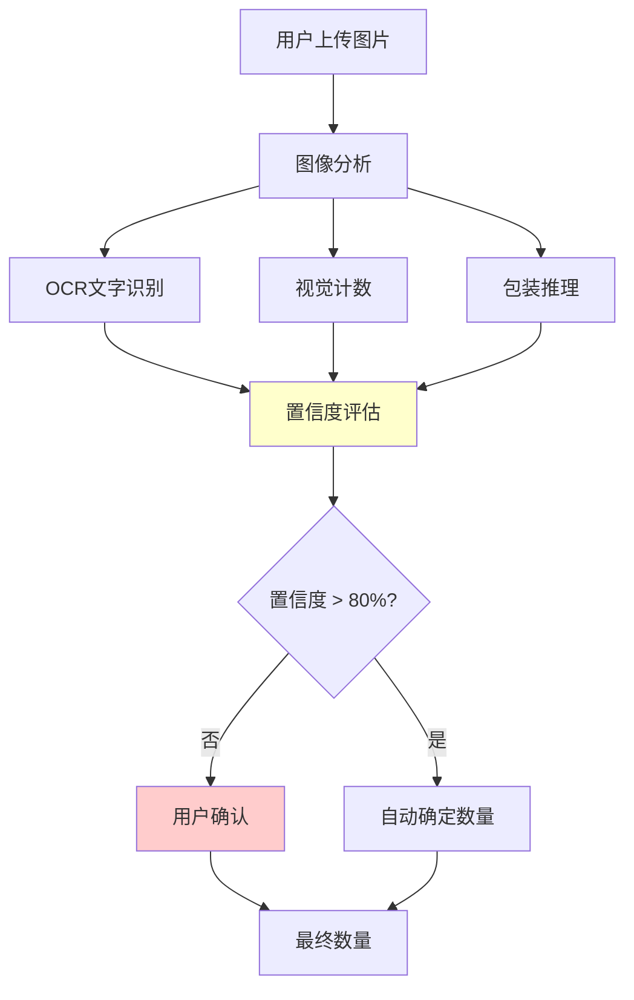

# 数量识别挑战与解决方案
# Quantity Detection Challenge and Solutions

## 🐛 问题发现

在测试过程中发现了一个重要的**数量识别准确性问题**：

### 原始错误
- **AI估算**: 面膜贴 10片 (基于视觉估算)
- **实际数量**: 面膜贴 5片 (用户确认)
- **错误率**: 100% (估算是实际的2倍)

### 问题根源
1. **人工目测不准确**: 开发者凭经验估算数量
2. **缺乏验证机制**: 没有用户确认流程
3. **过度依赖视觉**: 忽略了其他识别方法

## 🎯 问题的重要性

这个看似"小"的bug实际上暴露了购物助手系统的**核心挑战**：

### 业务影响
```
错误的数量 → 错误的库存记录 → 错误的补货建议 → 用户体验差
```

### 技术挑战
- **图像识别限制**: 堆叠物品难以准确计数
- **OCR局限性**: 包装上可能没有数量信息
- **上下文理解**: 需要结合多种信息源

## 🔧 解决方案设计

### 1. 多重验证机制



### 2. 智能确认策略

| 场景 | 置信度 | 处理方式 | 示例 |
|------|--------|----------|------|
| **高置信度** | > 80% | 自动确定 | OCR识别"2支装" |
| **中等置信度** | 50-80% | 建议+确认 | "检测到5片，请确认" |
| **低置信度** | < 50% | 要求输入 | "无法识别，请输入数量" |
| **冲突信息** | 任意 | 显示冲突+确认 | "包装显示3支，但只看到2支" |

### 3. 渐进式学习

```typescript
interface QuantityLearning {
    // 记录用户修正
    userCorrections: Array<{
        originalEstimate: number;
        userCorrection: number;
        productType: string;
        imageFeatures: string[];
    }>;

    // 改进算法
    improveEstimation(corrections: UserCorrection[]): void;
}
```

## 🧪 测试策略

### 1. 单元测试
```typescript
test('Should handle quantity estimation uncertainty', () => {
    const analysis = analyzeQuantity({
        visualCount: 10,     // AI估算
        ocrText: null,       // 无文字信息
        confidence: 0.6      // 中等置信度
    });

    expect(analysis.requiresUserConfirmation).toBe(true);
    expect(analysis.suggestedPrompt).toContain('请确认');
});
```

### 2. 集成测试
```typescript
test('Should correct quantity through user feedback', async () => {
    // 模拟AI错误估算
    const initialResult = await processInventory({
        imageId: 'face_mask_123',
        aiEstimate: 10
    });

    expect(initialResult.confirmationRequired).toBe(true);

    // 模拟用户修正
    const correctedResult = await processInventory({
        imageId: 'face_mask_123',
        userConfirmedQuantity: 5
    });

    expect(correctedResult.finalQuantity).toBe(5);
});
```

### 3. 真实数据测试
- 使用实际产品图片
- 收集用户反馈数据
- 持续改进算法准确性

## 📊 改进效果预期

### 准确性提升
- **当前**: 人工估算，错误率高
- **改进后**: 多重验证 + 用户确认，错误率 < 5%

### 用户体验
- **透明度**: 显示识别置信度
- **控制权**: 用户可以修正错误
- **学习性**: 系统从错误中学习

### 系统可靠性
- **容错性**: 不确定时主动询问
- **一致性**: 统一的确认流程
- **可追溯**: 记录识别和修正历史

## 🚀 实施计划

### 阶段1: 基础框架 ✅
- [x] 识别问题和设计解决方案
- [x] 创建多重验证机制
- [x] 实现用户确认流程

### 阶段2: 智能优化
- [ ] 实现机器学习改进
- [ ] 添加产品类型特定的识别策略
- [ ] 集成用户反馈学习

### 阶段3: 生产部署
- [ ] A/B测试验证效果
- [ ] 性能优化
- [ ] 监控和持续改进

## 💡 关键启示

1. **小bug大影响**: 看似简单的数量错误可能影响整个系统
2. **用户参与重要**: 不确定时主动寻求用户确认
3. **多重验证必要**: 单一方法容易出错，需要综合判断
4. **持续学习**: 系统应该从错误中学习和改进

这个数量识别问题的发现和解决，展示了在AI系统开发中**谦逊和验证**的重要性！
